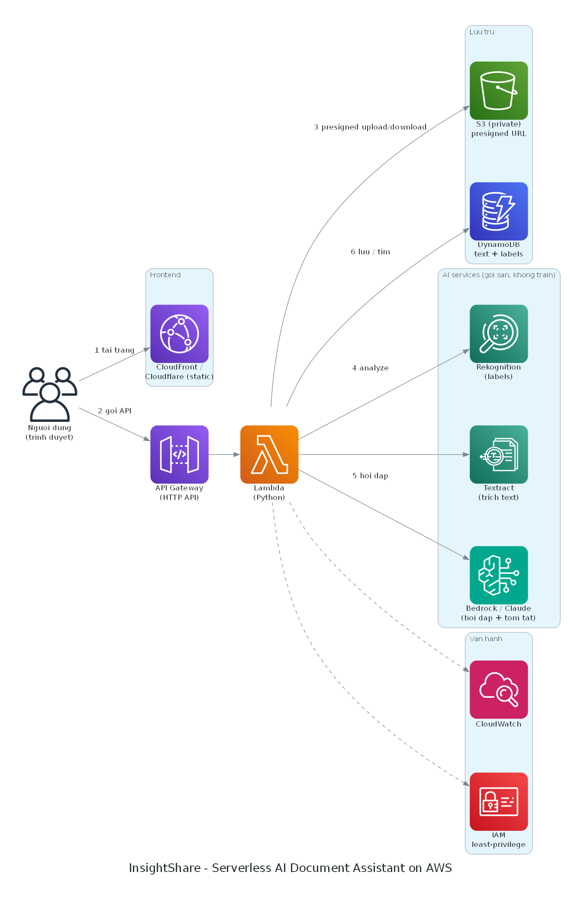

# InsightShare

A serverless document assistant on AWS, built as the capstone for the First Cloud AI Journey (FCAJ) internship at AWS Vietnam.

## What it does

You upload an image or PDF, and InsightShare turns it into something you can search and question:

- Extracts text with Amazon Textract and detects labels with Amazon Rekognition.
- Stores the extracted metadata (text, labels, file info) in DynamoDB.
- Lets you search across your files by their actual content, not just filenames.
- Lets you ask questions about a document in plain language, answered by Amazon Bedrock (Claude).

The original files stay in a private S3 bucket. The browser never gets public URLs; it uploads and downloads through short-lived presigned URLs.

## How it works

End-to-end flow:

1. The frontend (static site on Cloudflare Workers, mirrored on GitHub Pages) calls API Gateway.
2. API Gateway routes to Python Lambda functions.
3. To upload, Lambda returns a presigned S3 URL and the browser puts the file straight into the private bucket.
4. Analyze: a Lambda runs Textract and Rekognition on the file, then writes the text and labels to DynamoDB.
5. Search: a Lambda queries the stored text and labels and returns matching files.
6. Ask: a Lambda sends your question to Bedrock (Claude) with the document's stored text as context, and returns the answer.

Design notes:

- Region: ap-southeast-1 (Singapore).
- Cost: roughly 1 USD/month at demo scale, since everything is pay-per-use and idle costs nothing.
- IAM: least-privilege roles, one per function, scoped to the resources it touches.
- Monitoring: CloudWatch logs and metrics across the Lambdas and API.

## Architecture

AWS services used: S3, CloudFront, API Gateway, Lambda, DynamoDB, Textract, Rekognition, Bedrock, CloudWatch, IAM.

## Links

- Report site (GitHub Pages): https://xeminol.github.io/InsightShare/
- Live app demo: https://insightshare.dangthaikhang34.workers.dev

Note: the backend (Lambda functions and API Gateway) may be torn down after grading to avoid ongoing cost. If the demo link does not respond, the frontend is still up but the API has been removed.

## Repo layout

This repository holds the Hugo report site, not the application code. The report is bilingual (English and Vietnamese) and lives under `content/`:

| Folder | Section |
|---|---|
| `content/_index.md` | Home and student info |
| `content/1-Worklog/` | Weekly worklog |
| `content/2-Proposal/` | Project proposal |
| `content/3-BlogsPosted/` | Blog posts |
| `content/4-EventParticipated/` | Events attended |
| `content/5-Workshop/` | Step-by-step technical lab |
| `content/6-Self-evaluation/` | Self-evaluation |
| `content/7-Feedback/` | Feedback and takeaways |

Every push to `main` triggers GitHub Actions, which builds the site with Hugo and deploys it to GitHub Pages.
