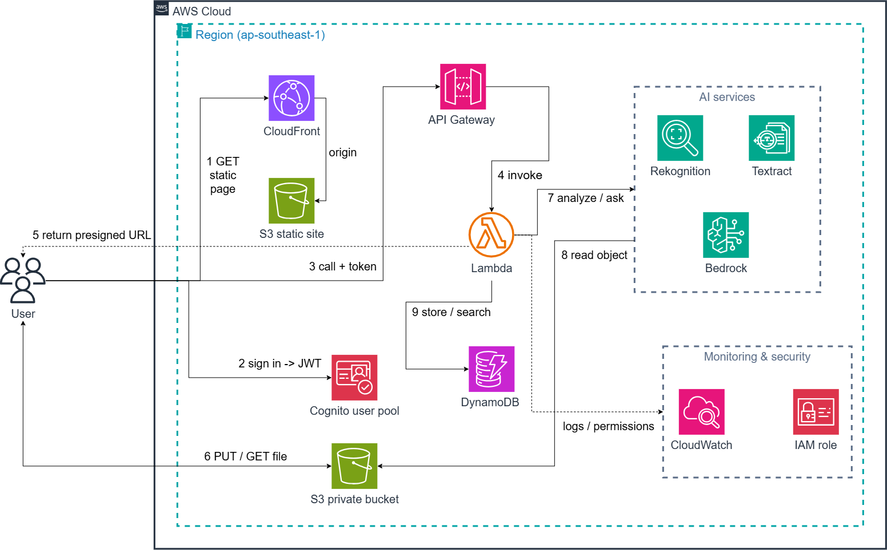
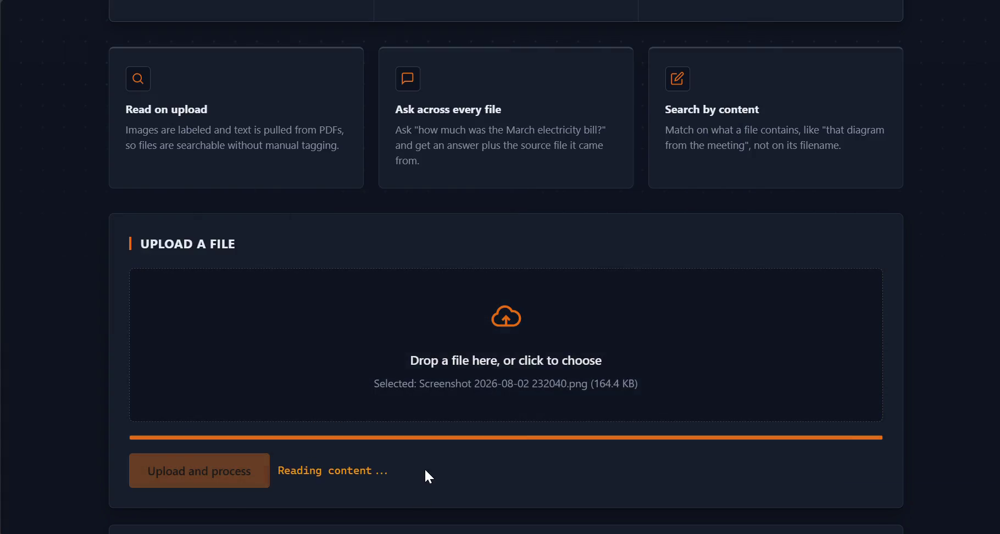
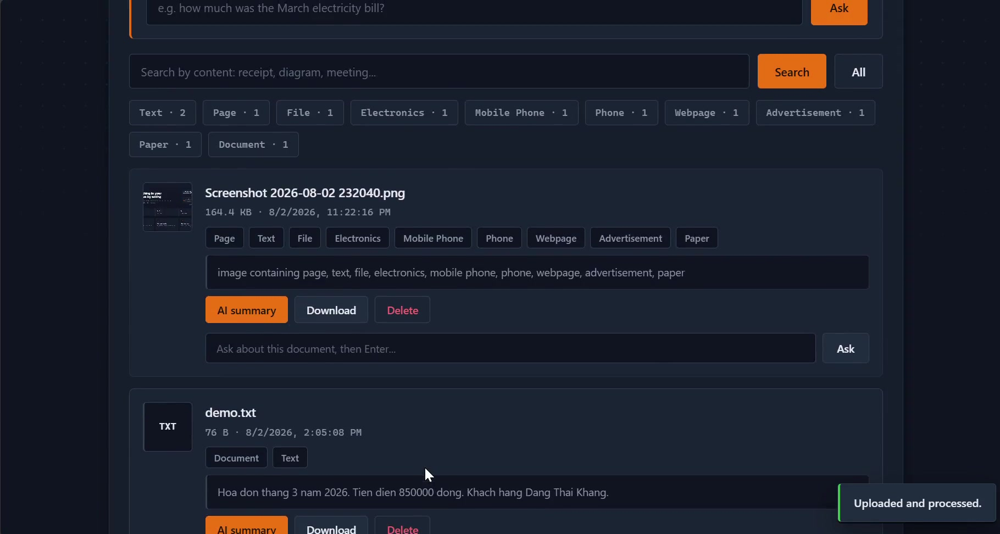
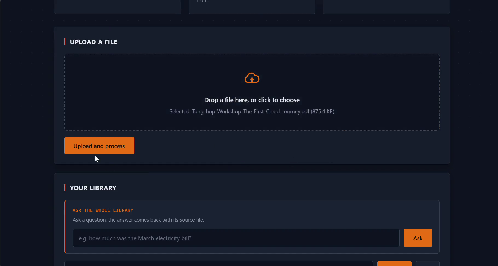

A serverless document assistant on AWS, built as the capstone for the First Cloud AI Journey (FCAJ) internship at AWS Vietnam.

Upload an image or a PDF and InsightShare reads it for you: it labels images, pulls text out of documents, and lets you find a file by a word that appears **inside** it rather than in its name. You can also ask a question in plain language and get an answer traced back to the file it came from.

**[Demo video](https://xeminol.github.io/InsightShare/videos/insightshare-demo.mp4)**

> The AWS resources were torn down after recording the demo, so the hosted page now shows the interface only. 

---

## Architecture

---

## Running stages

### 1. Pick a file and upload

### 2. Using AWS AI Rekognition

### 3. Ask across the whole library

---

## How it works

1. The static frontend signs in through Cognito and calls API Gateway with the JWT.
2. API Gateway validates the token with a JWT authorizer on the `$default` route, then routes to one Lambda. `OPTIONS` is left unauthenticated so the CORS preflight is not blocked.
3. **Upload:** Lambda returns a presigned S3 URL; the browser puts the file straight into the private bucket.
4. **Analyze:** triggered two ways — an `s3:ObjectCreated` event fires it automatically, and the browser can also call the analyze endpoint directly when it wants the result immediately. Both run the same code.
5. **Search:** Lambda matches the keyword against the stored labels and text in DynamoDB.
6. **Ask:** Lambda sends the question plus the stored text to Bedrock (Claude) and returns the answer with its source.

## Design notes

- **Region:** ap-southeast-1 (Singapore).
- **Cost:** about 1 USD/month at demo scale — everything is pay-per-use and idle costs nothing.
- **Auth:** a Cognito user pool; the JWT `sub` claim scopes every file to its owner, so a user only ever sees their own files.
- **IAM:** one least-privilege execution role. S3 and DynamoDB are scoped to the exact bucket and table ARNs; the AI actions use `*` because Rekognition, Textract and Bedrock have no resource-level permissions.
- **Fail-soft:** every AI call is wrapped, so a service being unavailable returns a short message instead of a 500.
- **Monitoring:** CloudWatch logs and metrics, two alarms on the function, and a three-widget dashboard.
- **Infrastructure as code:** a CloudFormation template defines all 17 resources, so the stack is reproducible instead of clicked together. It is kept outside this repository, which holds the report.
